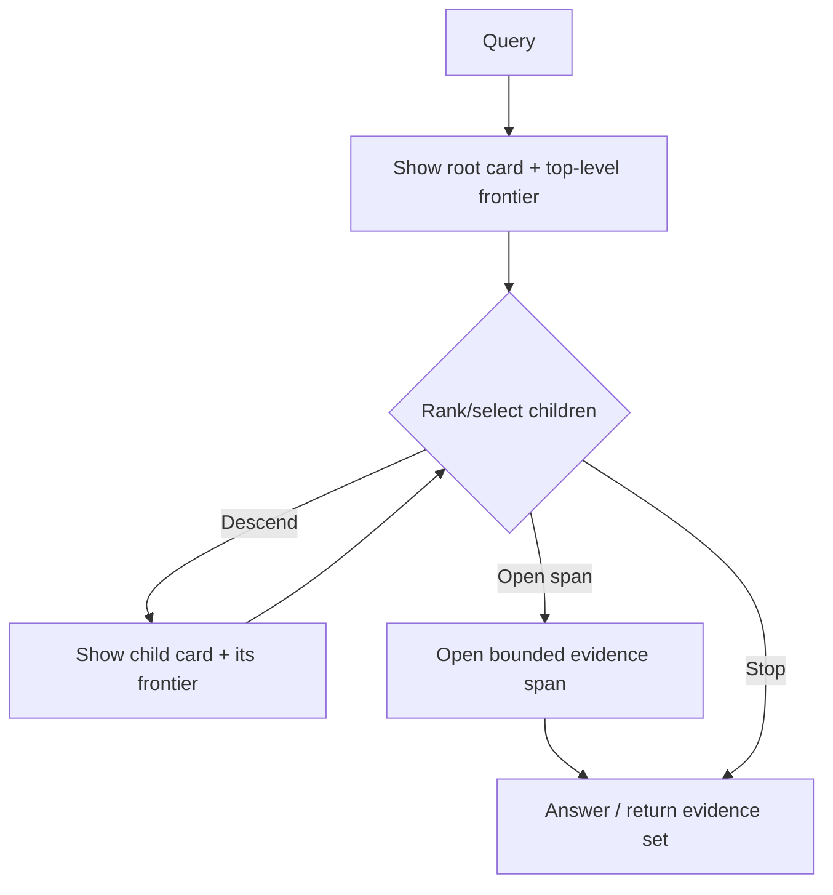
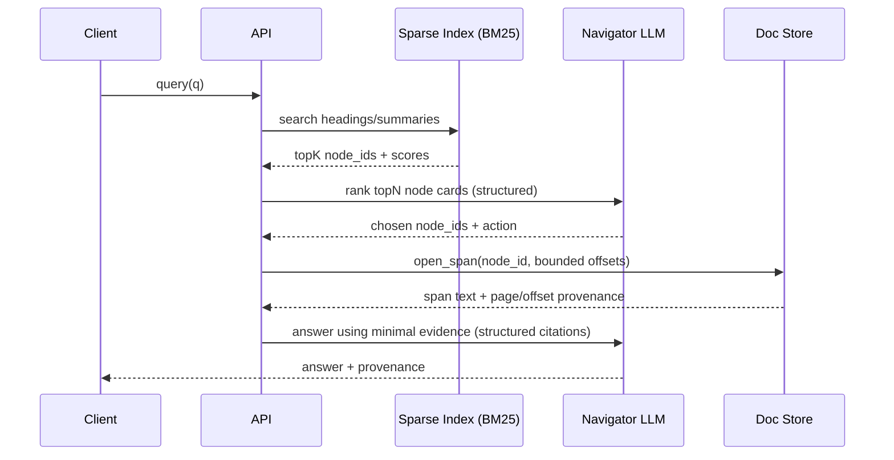

# Enterprise Vectorless RAG with Hierarchical Semantic Trees

## Executive summary

I recommend treating “vectorless RAG” as an **indexing and routing problem over structure**, not as “RAG without embeddings”. The enterprise-grade design is a **hierarchical semantic tree** (TOC-style) whose nodes carry compact, versioned **node cards** (IDs, path, ranges, summaries, keywords, provenance) and whose leaves reference **bounded evidence spans** (page ranges / character offsets). Query-time retrieval is then a controlled traversal that progressively exposes only a small **frontier** to an LLM navigator, ideally via stable tool primitives (list children, fetch node cards, open span, verify). This direction aligns with contemporary hierarchical retrieval patterns such as GraphRAG’s use of hierarchical community summaries and dynamic selection/pruning to avoid expensive global sweeps. citeturn0search4turn0search12

Long-context models do not remove the need for careful context shaping. Empirically, models can underutilise information placed in the middle of long contexts (“lost in the middle”), which makes naïve “stuff the tree into the prompt” both expensive and unreliable. citeturn0search6turn0search10 I therefore recommend frontier-only prompting, hierarchical compression (summary-of-summaries), and post-retrieval context pruning (e.g., Provence) as first-class mechanisms. citeturn1search0turn0search0

For latency, I view iterative LLM reasoning as a **conditional capability**, not the default retrieval path. Rate limits and retry behaviours are explicit in provider documentation (429 handling, exponential backoff, SDK retries), so p95 latency will be highly variable if the LLM is on the critical path for every query. citeturn8search11turn8search3turn9search6turn9search14 Achieving sub-second retrieval under a “no GPUs” constraint requires a **two-lane architecture**: a deterministic, sparse-index lane (BM25/inverted index over headings/summaries/node cards) plus aggressive caching; and an agentic lane invoked only for ambiguous routing or global synthesis. citeturn7search4turn1search3

Finally, enterprise robustness depends on strict boundaries: use provider-native JSON Schema structured outputs where available (with explicit migration/versioning awareness), validate again in typed models, and expose storage/metadata/evaluation via MCP servers to avoid hardcoding tool schemas in prompts. citeturn3search0turn3search8turn3search5turn3search1 I treat deprecation monitoring as an operational requirement: track vendor deprecations and library semver policies, pin versions, and fail CI on deprecation warnings. citeturn9search0turn9search1

## Algorithms for tree navigation

### Formalising TOC retrieval as a control problem

I model TOC navigation as a sequential decision process over a rooted tree (or DAG if you later add cross-links). The (query, tree, traversal history) tuple defines a state; actions select nodes/spans to inspect; rewards proxy “grounded evidence utility”. This framing matches the “reasoning + acting” paradigm (interleaving tool calls with reasoning), which is a good conceptual match for a navigator agent. citeturn6search1

A practical state/action/reward definition that works in production without training a custom RL agent is:

- **State** `s = (q, v, F(v), H, B)` where `q` is the query, `v` is current node, `F(v)` is a bounded frontier (child node cards), `H` is a minimal structured trace, and `B` is a budget (steps, tokens, milliseconds).
- **Actions**: `DESCEND(child_id)`, `BACKTRACK()`, `OPEN_SPAN(node_id, bounds)`, `RANK(frontier)`, `KEYWORD_SEARCH(query)`, `STOP()`.
- **Reward**: offline, use evaluation outcomes (answer correctness with citations); online, use surrogates (relevance score, entailment score, “answerability” judge) with strong guardrails to avoid self-delusion loops. (Most of these reward options are engineering choices; the papers below motivate the overall search framing, but exact reward shaping is system-specific and therefore unspecified.) citeturn0search1turn6search0

### Monte Carlo Tree Search as bounded exploration

#### Core mechanics

MCTS is a general framework that iteratively grows a search tree by repeating **selection → expansion → evaluation (simulation) → backpropagation**. In practice, the UCT variant uses bandit-style upper confidence bounds to balance exploration vs exploitation during selection. citeturn6search0turn6search12

- **Selection**: traverse from root by choosing child `u` that maximises a UCT-style score such as  
  `UCT(u) = Q(u) + c * sqrt( ln N(parent) / N(u) )`, with appropriate handling for unvisited nodes. citeturn6search0
- **Expansion**: when reaching an unexpanded node, fetch its node card and its immediate children cards (bounded).
- **Evaluation**: estimate utility (relevance/answerability) using a cheap scorer first; escalate to a heavier judge only on ambiguity.
- **Backpropagation**: update `N` visits and `Q` value estimates along the selected path.

#### State/action/reward instantiation for TOC retrieval

- **State**: `(q, current_node v, opened_spans E, remaining_budget B, cached_scores C)`.
- **Action**: choose a child to expand or a leaf span to open.
- **Reward**: I recommend a two-tier surrogate:  
  `r = α * card_relevance(q, node_card) + (1-α) * evidence_yield(q, opened_span)`  
  where `card_relevance` is lexical/reranker-driven and `evidence_yield` is measured from extracted spans. Exact α and scoring models are system-specific (unspecified). This structure is motivated by the fact that UCT needs a numeric reward signal but retrieval rarely has immediate ground truth online. citeturn6search0turn7search4

#### Compute and token-cost model

Let:

- branching factor `b` (avg children per node),
- depth explored `d`,
- rollouts `R`,
- `t_card` tokens per node card shown to any LLM step,
- `t_eval` tokens for an LLM “judge” output (often small if structured),
- `p_llm` fraction of evaluations that require an LLM call (ideally low).

Then:

- **Time complexity (algorithmic)**: `O(R * d)` node-visits, with retrieval-time dominated by evaluation cost. citeturn6search0  
- **Token cost (if LLM judge used)**: approximately  
  `Tokens ≈ R * p_llm * (t_card_frontier + t_eval)`  
  where `t_card_frontier` includes the candidate set fed to the judge. (This is an engineering budget model; token accounting depends on provider tokenisation and is therefore unspecified.) citeturn3search0turn8search11

#### Failure modes

MCTS can fail in TOC retrieval when:

- **Reward mismatch**: node-card relevance does not correlate with “answerability”, causing systematic exploration of attractive but unproductive branches. citeturn6search0turn0search6
- **Evaluation noise**: if LLM judges are inconsistent, backpropagated `Q` values become unstable (especially under low rollout budgets). citeturn6search1turn6search0
- **Latency blow-ups**: even bounded rollouts can exceed SLA if evaluations trigger network LLM calls; provider rate limiting and retries amplify tail latencies. citeturn8search11turn9search6
- **Audit explosion**: many rollouts create many traces; auditability is high only if every step is logged with stable IDs and scores (engineering requirement, unspecified).

#### When I use it

I treat MCTS as a **fallback** for hard queries that fail deterministic routing and simple agentic traversal—particularly “wide” TOCs where greedy descent is brittle. It is rarely suitable as a fast-path under a strict sub-second retrieval goal without GPUs, unless your evaluation is overwhelmingly non-LLM. citeturn6search0turn8search11

#### Pseudocode and complexity estimate

```text
# MCTS-UCT for TOC routing (budgeted)
function mcts_route(query q, node root, int R, int d_max):
    init N[node]=0, Q[node]=0  for nodes encountered
    for r in 1..R:
        path = []
        v = root

        # selection + expansion
        for depth in 1..d_max:
            children = list_children(v)              # tool call (cached)
            if children is empty: break
            v = argmax_u(children, uct_score(Q[u], N[u], N[v]))
            path.append(v)
            if N[v] == 0:
                cache_node_card(v); cache_children(v)
                break

        # evaluation (cheap first, LLM only if ambiguous)
        value = evaluate(q, v)   # lexical/reranker/optional LLM judge

        # backprop
        for n in path:
            N[n] += 1
            Q[n] = Q[n] + (value - Q[n]) / N[n]

    return best_child(root) by Q
```

The algorithmic node-visit cost is `O(R * d_max)`; the wall-clock cost is dominated by `evaluate()` latency and any remote calls it triggers. citeturn6search0turn8search11

### Tree of Thoughts as search over navigation hypotheses

#### Core mechanics

Tree of Thoughts (ToT) generalises chain-of-thought into an explicit search over multiple intermediate “thoughts” with self-evaluation, backtracking, and lookahead, improving performance on tasks that require exploration. citeturn0search1turn0search5

For TOC retrieval, I map:

- “thought” → a navigation hypothesis (e.g., “Section 7.2 likely contains retry semantics because summary mentions timeouts”).
- self-evaluation → a relevance/answerability score conditioned on query and node cards.

ToT becomes implementable as **beam search** over candidate nodes/plans.

#### State/action/reward instantiation

- **State**: `(q, current_node v, frontier_cards, trace, remaining_budget)`.
- **Action**: propose `W` candidate next steps (child selections or short multi-step plans).
- **Reward/score**: rank candidates; optionally revise after opening a minimal span.

This is directly aligned with ToT’s emphasis on exploring multiple paths and selecting among them via model self-evaluation. citeturn0search1

#### Compute and token-cost model

Let:

- depth `D`,
- generated candidates per state `W`,
- beam width `B`,
- cards per candidate shown during ranking `k` (bounded).

Naïve ToT costs `O(D * B * W)` candidate expansions. I reduce LLM call count by doing **one-call-many-judgements**: rank all candidates for a depth in a single structured output. This makes LLM call count closer to `O(D)` rather than `O(D * B * W)`, with token cost scaling in `O(B * W * t_card)` per depth. citeturn0search1turn3search0

#### Failure modes

- **Beam collapse**: early misranking prunes the correct subtree.
- **Self-evaluation bias**: the model may over-trust superficial keyword overlap in node cards.
- **Context position sensitivity**: if you pack too many candidates, “lost in the middle” effects can degrade ranking; I mitigate by hard-capping candidate count and ordering. citeturn0search6turn0search10

#### When I use it

I use ToT as a **high-recall fallback** when greedy navigation is suspect (ambiguous routing, multiple plausible sections). Under strict latency constraints, I only use ToT if it can be reduced to one or two ranking calls over compact candidate sets. citeturn0search1turn8search11

#### Pseudocode and complexity estimate

```text
# ToT-style beam for TOC routing
function tot_route(query q, root, int D, int B, int W):
    beam = [{node: root, trace: [], score: 0.0}]

    for depth in 1..D:
        cands = []
        for s in beam:
            frontier = get_frontier_cards(s.node)       # bounded
            cands += propose_candidates(q, s, frontier, W)

        # single-call ranking for all candidates at this depth
        scored = rank_candidates_one_call(q, cands)      # structured output
        beam = top_k(scored, B)

        if any beam item signals "open span now":
            break

    best = argmax(beam, score)
    return execute_trace(best)
```

Candidate generation is `O(D * B * W)`; call count is engineered to `O(D)` by one-call ranking. citeturn0search1turn3search0

### Custom LLM-driven graph traversal via tool use

#### Core mechanics

The ReAct paradigm formalises interleaving reasoning with actions that query external systems, improving interpretability and reducing hallucination by grounding decisions in retrieved information. citeturn6search1turn6search9 I apply this to TOC navigation by exposing stable tools:

- `keyword_search_cards(q)` → returns node IDs + scores (sparse index)
- `list_children(node_id)` → topology
- `get_node_cards(node_ids)` → bounded cards
- `open_span(node_id, bounds)` → bounded evidence
- `verify_heading(node_id)` → checks heading presence in range (optional)

This approach also matches newer agentic RAG thinking where the model participates in retrieval decisions via hierarchical retrieval interfaces rather than executing a fixed pipeline. citeturn1search3

#### State/action/reward instantiation

- **State**: `(q, current node, frontier cards, evidence snippets, confidence)`.
- **Action**: select a next tool call and its arguments; enforced via structured outputs.
- **Reward**: operationally, I use a confidence-gated stopping rule rather than numeric reward optimisation (engineering choice, unspecified), because the retrieval goal is “sufficient grounded evidence” not “maximise a scalar”.

#### Compute/token-cost model

If I cap navigation to:

- one sparse retrieval (`keyword_search_cards`),
- one LLM ranking over `N` cards,
- one bounded span open,
- optional verify step,

then LLM calls can be kept to 1–3 per query, and token costs scale primarily with `N * t_card + t_span`. The feasibility of sub-second retrieval depends on how often I can avoid remote calls (see two-lane architecture below). citeturn8search11turn9search6

#### Failure modes

- **Greedy traps**: without backtracking, the agent can descend into an irrelevant branch.
- **Schema drift**: if tool schemas change without versioning, prompts break; MCP is my preferred stabiliser. citeturn3search5turn3search1
- **Prompt bloat**: too many cards/snippets reintroduce lost-in-middle failure; I mitigate with frontier caps and pruning. citeturn0search6turn0search0

#### When I use it

This is my **primary strategy for the agentic lane** because it is auditable (explicit actions over stable IDs) and can be engineered to a small call budget. citeturn6search1turn3search0

#### Pseudocode and complexity estimate

```text
# Tool-using traversal (engineered for low call count)
function traverse(query q, root, int max_steps):
    node = root
    evidence = []

    # deterministic prefilter
    candidates = keyword_search_cards(q)   # sparse index
    node = select_best_root_child(candidates)

    for step in 1..max_steps:
        frontier = get_node_cards(list_children(node), limit=N)

        # LLM chooses next action among frontier (structured)
        decision = llm_decide(q, node, frontier, evidence)

        if decision.action == "DESCEND":
            node = decision.node_id
        elif decision.action == "OPEN_SPAN":
            evidence += open_span(decision.node_id, decision.bounds)
            if sufficient(evidence): return evidence
        elif decision.action == "BACKTRACK":
            node = parent(node)
        else:
            return evidence

    return evidence
```

Traversal cost is `O(max_steps * N)` for scoring candidates, with wall-clock dominated by tool and provider latencies (variable). citeturn8search11turn6search1

### Comparative table for navigation approaches

I use the following operational comparison when selecting the navigation controller (values are qualitative because published, apples-to-apples latency figures for this specific TOC setting are unspecified):

| Approach | Accuracy potential | Latency risk | Parallelisability | Implementation complexity | Auditability |
|---|---|---|---|---|---|
| MCTS (UCT) | High on wide/ambiguous trees if reward is well-shaped citeturn6search0 | High if evaluation uses network LLM calls citeturn8search11turn9search6 | Medium (rollouts parallelise; stats sync needed) | High (reward engineering, budgets) | Medium–High if all rollouts logged |
| ToT (beam) | High recall in multi-branch uncertainty citeturn0search1 | Medium–High (beam expansion; ranking cost) | High (candidate scoring & ranking parallelisable) | Medium | High if structured rankings persisted |
| Tool-using traversal | Medium–High with good prefilters + backtracking citeturn6search1turn7search4 | Low–Medium if call budget capped | High (prefilter local; bounded async fan-out) | Medium | High (explicit action trace over stable node IDs) |

## Context window optimisation

### Node cards as the unit of navigation

I represent each TOC node as a compact “node card” designed to be both **prompt-efficient** and **auditable**. The key is to encode *just enough* semantics for routing without forcing the model to read large text blocks.

A production node card schema I use (exact field names are an implementation choice, unspecified) contains: stable `node_id`, full `path`, `level`, `title`, `page_range` or `char_offset_range`, a 1–2 sentence summary, key terms, and a small number of short “anchors” (verbatim snippets) for grounding. This mirrors hierarchical retrieval systems that precompute summaries at multiple levels (RAPTOR-style recursive summaries; GraphRAG community summaries). citeturn1search0turn0search12

### Progressive disclosure and frontier-only prompting

Because long contexts can be underutilised in the middle positions, I avoid presenting large sibling sets in one prompt. “Lost in the middle” shows clear position effects for long-context utilisation, so my prompting strategy is: show a small frontier, rank/select, descend, repeat. citeturn0search6turn0search10



This traversal pattern is also consistent with GraphRAG’s dynamic selection idea: use hierarchy to decide where to spend expensive reasoning and where to prune. citeturn0search4turn0search12

### Hierarchical compression and summarise-of-summaries

I use hierarchical compression to ensure that higher-level nodes summarise children and can route the model without opening full text. RAPTOR explicitly constructs a tree with differing levels of summarisation and retrieves from multiple levels at inference time, which motivates this approach in a directly relevant way. citeturn1search0turn1search4

For global queries, I prefer retrieving high-level summaries first and only opening leaf spans after the model commits to a subtree. This reduces token load and improves auditability (fewer irrelevant spans are ever read). citeturn1search0turn0search12

### Context pruning after selection

Even after correct routing, opened spans can contain irrelevant material (tables, footers, boilerplate). Provence frames context pruning as removing irrelevant parts of retrieved contexts before generation, aiming to reduce overhead and reduce the injection of irrelevant content into outputs. citeturn0search0turn0search11 I apply pruning at two layers:

- **Subtree pruning**: drop irrelevant branches early using sparse scores + a single ranking call.
- **Span pruning**: reduce retrieved spans to only the sentences/rows needed for grounding (implementation-specific; pruning model choice unspecified). citeturn0search0

### One-call-many-judgements prompts

To minimise provider calls (and therefore tail latency under rate limits), I prefer ranking many candidates in one call with a strict schema. Structured outputs are explicitly intended to ensure adherence to a supplied JSON Schema, reducing post-processing and enabling deterministic routing decisions. citeturn3search0turn3search4

**Example prompt template for ranking node cards (schema-driven)**

```text
System: You are a retrieval controller. Rank candidate TOC nodes for relevance to the query.
User:
Query: {q}

Candidate node cards (each is bounded):
1) id={id1} path={p1} title={t1} range={r1} summary={s1} keywords={k1}
...
N) id={idN} path={pN} title={tN} range={rN} summary={sN} keywords={kN}

Return JSON that matches the provided schema:
- ranked_ids: [string]  (length <= 5)
- confidence: 0..1
- rationale: {id: short_reason <= 20 tokens}
```

This template is engineered to avoid large mid-context candidate lists and to return machine-checkable decisions. citeturn0search6turn3search0

### Token budgeting (quantified)

Because token limits vary by provider/model and tokenisers, I enforce **engineering budgets** rather than relying on maximum context. My budget equation is:

`T_system + T_state + (N_cards * T_card) + (N_spans * T_span) + T_output ≤ T_context`

Where `T_state` is structured, minimal history, not raw conversation logs. The key control knobs are `N_cards` and `T_span`.

- I cap `N_cards` per step (typical engineered caps: 8–32; exact cap is workload-specific and therefore unspecified).
- I cap `T_span` by fetching bounded offsets/pages and pruning. citeturn0search6turn0search0

### Long-context and VLM considerations under “no GPUs”

The Gemini 1.5 report claims long-context multimodal capability across very large token contexts, including recalling and reasoning over fine-grained information from millions of tokens. citeturn6search3turn6search7 Under a “no GPUs” constraint, this implies relying on provider-side compute rather than local inference; cost/latency are provider-dependent and therefore unspecified. I treat long-context as a **safety valve** for exceptional cases (e.g., deeply interdependent sections) rather than as the default prompt strategy, because lost-in-the-middle effects still motivate frontier-only prompting and pruning. citeturn0search6turn6search3



This prompt flow is engineered to keep the model focused on a small decision frontier and only open text late. citeturn3search0turn0search6

## Accuracy and latency trade-offs

### Two-lane architecture (deterministic fast lane + conditional agentic lane)

I architect retrieval as two lanes:

- **Lane A (fast deterministic)**: sparse retrieval over node cards (titles/headings/summaries/keywords), returning top node IDs and minimal cards; no LLM calls required for retrieval decisions.
- **Lane B (conditional agentic)**: tool-using traversal (or ToT/MCTS fallback) invoked only if Lane A confidence is low or the query requires global synthesis.

This mirrors the motivation in A‑RAG: existing RAG often forces either single-shot retrieval concatenation or a predefined workflow; A‑RAG instead exposes hierarchical retrieval interfaces to the model so it can adaptively search and read at multiple granularities. citeturn1search3

### Lightweight prefilters: BM25/inverted index over headings and summaries

I use BM25 (and related probabilistic relevance framework methods) because it is a well-established sparse ranking baseline and works well for heading/title heavy corpora. The Robertson & Zaragoza review describes BM25 and its probabilistic relevance framework foundations. citeturn7search4turn7search8

Operationally, I index:

- node titles and normalised heading text,
- node summaries,
- glossary/definition nodes (if present),
- optionally, keywords extracted during ingestion.

This keeps the “vectorless” requirement intact while still providing strong routing signals.

### Caching strategies

To hit sub-second retrieval consistently without GPUs, caching must align with hierarchical navigation:

- **Node-card cache**: `node_id + doc_version → node_card`.
- **Path cache**: `(normalised_query, tenant, corpus_version) → chosen_path + confidence`.
- **Child-score cache**: common domain terms pre-scored against children sets for frequent router nodes (implementation-specific; unspecified).
- **Span excerpt cache**: frequently opened “definition spans” cached with offsets and provenance.

The correctness requirement is that caches are versioned by document/corpus version hashes so you never serve stale paths after ingestion updates (engineering requirement; unspecified).

### Parallel branch evaluation patterns

I use two patterns:

- **Single-call ranking**: rank `N` candidates in one structured-output call; preferred for lower call count and easier audit.
- **Bounded async fan-out**: evaluate 2–4 branches concurrently only when ambiguity remains, capped tightly to avoid rate-limit amplification.

Provider rate limits (RPM/TPM) and explicit 429 behaviour mean concurrency must be controlled; otherwise you increase the likelihood of retries and tail latency. citeturn8search11turn8search3turn9search6

### Latency targets under real provider/network constraints (no GPUs)

Published provider latencies for your specific models/routes are unspecified in primary docs; what is specified is that rate limits exist, 429 errors occur, exponential backoff is recommended, and SDKs retry certain errors by default—factors that directly affect p95. citeturn8search11turn8search3turn9search6turn9search14

I therefore define **engineering latency budgets** as a function of call count:

- Lane A: `L_total ≈ L_sparse + L_cache + L_store` (all local I/O; target sub-second).
- Lane B: `L_total ≈ LaneA + n_calls * L_provider + L_store_span`, where `L_provider` has high variance (measure in production; unspecified).

### Query routing table with expected paths and engineered P50/P95 budgets

The following table expresses **engineered targets**; real P50/P95 must be measured in your environment given provider/network constraints and rate limits (unspecified).

| Query type | Retrieval path | LLM calls on retrieval path | Engineered P50 target | Engineered P95 target |
|---|---|---:|---:|---:|
| Exact location (“Where is X defined?”) | Lane A only (BM25 over headings/defs) | 0 | 50–150 ms | 150–400 ms |
| Local section QA (“In section Y, what is Z?”) | Lane A → open one span | 0 | 80–250 ms | 250–700 ms |
| Ambiguous routing (“What are timeouts?” across systems) | Lane A → Lane B (rank cards) → open span | 1–2 | < 1.0 s (goal) | 2–6 s (budget) |
| Global synthesis (“Summarise architecture across doc”) | Lane A → Lane B (hierarchy summaries) → selective spans | 2–6 | 2–6 s | 6–20 s |
| Compliance/audit (must cite pages) | Lane A → Lane B + verify | 2–4 | 2–5 s | 5–15 s |

I make sub-second guarantees only for the Lane A categories; for the rest, I rely on streaming progress and partial results (SSE) to keep UX responsive while the agentic lane runs. SSE is standardised via the EventSource interface in the HTML standard. citeturn5search2turn5search22

## State-of-the-art literature synthesis

### RAPTOR

RAPTOR builds a tree of varying abstraction by recursively embedding, clustering, and summarising chunks bottom-up, then retrieves from multiple levels of this tree at inference time to integrate information across lengthy documents. citeturn1search0turn1search4 For vectorless TOC retrieval, my key takeaway is the value of **multi-level representations**: internal-node summaries can route and answer global questions, while leaves support precise grounded evidence.

### GraphRAG

GraphRAG combines extraction, graph/community analysis, and LLM summarisation into an end-to-end system for querying narrative private data using hierarchical structures. citeturn0search12turn0search8 The “dynamic community selection” idea—starting at coarse hierarchy levels, scoring relevance, and selectively descending—directly motivates TOC-tree traversal with aggressive pruning to reduce cost for global queries. citeturn0search4turn0search16

### HiRAG

HiRAG argues that existing RAG systems underutilise naturally inherent hierarchical knowledge and proposes using hierarchical knowledge in indexing and retrieval to improve performance. citeturn1search1turn1search13 For my design, this supports treating hierarchy as a first-class indexing signal rather than a post-hoc UI artefact.

### HippoRAG

HippoRAG proposes a retrieval framework inspired by hippocampal indexing theory that orchestrates LLMs, knowledge graphs, and personalised PageRank to integrate information across passages efficiently. citeturn1search2turn1search6 The practical message for TOC retrieval is that **graph algorithms can replace or reduce iterative LLM reasoning**: constructing an auxiliary “section graph” (cross-references, shared terminology, citations) and running PPR-like ranking can provide multi-hop retrieval behaviour in a single retrieval step (implementation details for your doc tree are system-specific; unspecified). citeturn1search6

### A‑RAG

A‑RAG exposes hierarchical retrieval interfaces (keyword search, semantic search, chunk read) directly to the model so the agent can adapt retrieval strategy and granularity per query rather than being constrained to single-shot retrieval or a predefined workflow. citeturn1search3turn1search7 This is the closest conceptual match to a TOC-tree navigator: the core engineering move is to make the agent’s allowed actions explicit and bounded.

## Agentic document parsing and ingestion for massive PDFs

### Deterministic-first ingestion strategy

For 10,000+ page PDFs, I assume heuristics will fail unless the pipeline is workflow-driven and verification-heavy. I start with deterministic structure sources:

- PyMuPDF exposes `Document.get_toc()` for extracting the existing PDF outline/TOC when present; it also documents outline coordinate/version behaviours. citeturn2search0turn2search16
- pypdf documents outline handling and how to resolve destination page indices with `get_destination_page_number()` (zero-based page index). citeturn2search1

If outline/TOC is present and reliable, I treat it as authoritative; if absent/partial, I infer hierarchy from headings using layout signals and numbering patterns (method specifics are implementation-defined and therefore unspecified).

### Workflow orchestration via state graphs

I model ingestion as a stateful graph with explicit fallbacks, retries, and verification loops, consistent with LangGraph’s distinction between predetermined workflows and dynamic agents and its emphasis on persistence/streaming/debugging for long-running processes. citeturn2search2turn2search18

Key stages in my ingestion graph:

1. Outline extraction (if present)  
2. Page ledger creation and stable offsets  
3. Text extraction (layout-aware)  
4. OCR fallback for low-confidence pages  
5. Hierarchy build / repair  
6. Summary/node-card generation (hierarchical)  
7. Verification loop (tree vs source)  
8. Commit with versioning

### OCR fallback (CPU-only) and VLM trade-offs (no GPUs)

For scanned or image-heavy pages, I use OCR as a deterministic fallback. The Tesseract repository states that Tesseract 4 adds an LSTM-based OCR engine and supports legacy modes via engine flags. citeturn2search3turn2search15 Tesseract traineddata repos document the availability of “best” and other variants (exact accuracy/speed figures are unspecified in the repos). citeturn2search19turn2search7

For vision-native extraction, the Gemini 1.5 report claims multimodal long-context processing across very large contexts. citeturn6search3turn6search7 Under “no GPUs”, I treat VLM usage as provider-side compute (cost/latency unspecified) and reserve it for pages where OCR/layout parsing demonstrably fails (complex tables, multi-column with interleaving, diagrams). Lost-in-the-middle still cautions me against feeding huge mid-heavy sequences even to long-context models. citeturn0search6turn6search3

### Page ledger and stable offsets

To keep concurrency safe and provenance auditable, I maintain a canonical **page ledger**:

- page index, extraction method, hashes of page renderings and extracted text, confidence flags, and an immutable mapping from page to accumulated character offset ranges in the canonical text stream.

This makes it possible to reference spans by stable offsets and page ranges even when pages are processed in parallel batches (implementation specifics are system-defined; unspecified). The motivation is to avoid drift and misalignment across OCR/text extraction branches.

### Avoiding lost-in-the-middle during concurrent ingestion

Lost-in-the-middle is relevant in ingestion when you batch large runs of pages into a single model context for TOC inference or summarisation. citeturn0search6turn0search10 I therefore summarise locally (per node/page), then summarise summaries, aligning with the hierarchical compression idea exemplified by RAPTOR. citeturn1search0

### Self-correction and verification loop

Before committing the tree, I run a verifier step that checks:

- each node title has a matching heading occurrence in the claimed page/span range (exact match or bounded fuzzy match; algorithm choice unspecified),
- parent/child level consistency,
- coverage (no “lost” pages unless explicitly exempted),
- summary grounding via anchors (short citations into spans).

This is consistent with the broader motivation for agentic tool use: ground decisions in external evidence rather than free-form generation. citeturn6search1

```mermaid
flowchart TD
  S[Start: PDF + doc_version] --> O[Extract outline/TOC if present]
  O -->|Found| T[Seed hierarchy from outline]
  O -->|Missing/partial| H[Infer headings & section boundaries]
  T --> L[Build page ledger + stable offsets]
  H --> L
  L --> X[Extract text/layout per page]
  X --> Q{Low confidence / scanned?}
  Q -->|Yes| OCR[OCR fallback (CPU)]
  Q -->|No| M[Proceed]
  OCR --> M
  M --> N[Generate node cards & hierarchical summaries]
  N --> V[Verify: headings/ranges/coverage/anchors]
  V -->|Pass| C[Commit tree + artefacts]
  V -->|Fail| R[Repair loop: adjust boundaries / missing nodes]
  R --> V
```

This ingestion architecture is built around deterministic-first parsing with explicit fallbacks and verification. citeturn2search0turn2search1turn2search2turn2search3

### Component responsibility and failure-mode table

| Component | Responsibility | Common failure modes | Mitigations |
|---|---|---|---|
| Outline extractor (PyMuPDF/pypdf) | Extract existing doc outline and resolve destinations | Outline missing; wrong destinations; API/version behaviour changes | Prefer outline when present; fall back to inferred headings; version pin |
| Heading/boundary inferencer | Build TOC when outline absent | False positives from tables/headers; missed headings | Multi-signal scoring; verification against spans |
| OCR engine (Tesseract) | Recover text from scanned/low-confidence pages | OCR noise; layout misreads | Track confidence; re-OCR with tuned settings; isolate noisy pages |
| Node-card builder | Summaries/keywords/anchors per node | Hallucinated summary; missing anchors | Strict prompt constraints; require anchors; verify |
| Verifier | Detect missing/incorrect nodes/ranges | Too slow if exhaustive | Sample + invariants; escalate on risk |
| Page ledger | Stable offsets/provenance | Drift under concurrency | Immutable ledger; idempotent merges; hashing |

The deterministic-first and OCR facts above reflect documented behaviours of PyMuPDF, pypdf, and Tesseract; the mitigations are engineered controls (system-specific). citeturn2search0turn2search1turn2search3

## Resilient LLM interfacing and deterministic outputs

### Provider-native structured outputs vs library validation

When I need complex nested JSON (document trees, retrieval decisions), I avoid “regex JSON fixes” by enforcing schemas.

Provider-native structured outputs: entity["company","OpenAI","ai api provider"] documents Structured Outputs as ensuring the model generates responses that adhere to a supplied JSON Schema, reducing invalid enums/missing keys. citeturn3search0turn3search4 It also documents migration details: in the Responses API, structured output definitions moved (from `response_format` to `text.format`), which matters for long-lived enterprise code. citeturn3search8turn9search19

Library-side validation: **entity["organization","Pydantic","python validation library"]** generates JSON Schema compliant with JSON Schema Draft 2020-12 and OpenAPI 3.1, enabling reuse of the same schema across providers and internal validators. citeturn7search1turn7search13 **Instructor** positions itself as extracting structured, validated data from LLMs using Pydantic models and handling validation/retries/error-handling. citeturn7search2turn7search14

My production stance is defence-in-depth: use provider-native strict schema outputs when supported, then validate again at the application boundary with typed models to enforce invariants (e.g., page ranges, node existence). citeturn3search0turn7search1

### MCP servers for tool/schema decoupling

The Model Context Protocol (MCP) is specified as an open protocol for connecting LLM applications with external tools and data sources, with server “tools” carrying schemas and metadata. citeturn3search5turn3search1 I use MCP servers to expose:

- document storage primitives (get node card, list children, open span, page ledger),
- metadata lookup and policy (redaction, ACLs),
- evaluation harness (regression tests, retrieval metrics).

This moves tool schemas out of prompt text and into versioned server contracts, making prompt/tool drift less likely. citeturn3search1turn3search5

### Gateway resiliency: routing, retries, circuit breakers, context fallbacks

Rate limits are documented as restrictions on call volume and/or tokens, and 429 indicates rate limit reached; recommended mitigations include backoff. citeturn8search11turn8search3turn9search14 The OpenAI Python SDK documents that certain errors are retried by default (including 429 and >=500) and that `max_retries` can configure this. citeturn9search6

I therefore design the gateway with explicit policies:

- bounded retries with jitter and hard timeouts,
- circuit breakers per model route,
- “context-length fallback” tactics: shrink frontier, increase compression, defer to offline summaries (exact thresholds unspecified),
- strict error propagation (never swallow tracebacks).

I also operationalise deprecation tracking: OpenAI publishes an API deprecations page with deadlines; I integrate this into dependency governance. citeturn9search0 For framework dependencies, I rely on documented semver/deprecation policies (e.g., LangChain’s stated approach to deprecations and major releases) to plan upgrades. citeturn9search1

### Type safety in downstream systems (Rust/TypeScript)

For Rust, **entity["organization","Serde","rust serialization framework"]** describes itself as a framework for serialising/deserialising Rust data structures efficiently and generically. citeturn8search0 For TypeScript, **entity["organization","Zod","typescript validation library"]** is documented as a TypeScript-first validation library that defines schemas used to validate data and return type-safe parsed results. citeturn7search3

My practice is to generate or hand-maintain schemas once, then:

- validate LLM outputs against JSON Schema / Pydantic,
- map into Rust structs (Serde) or TS types (Zod),
- enforce invariants that JSON Schema cannot express easily (e.g., “end_offset > start_offset”) at the type layer (implementation-specific; unspecified). citeturn7search1turn8search0turn7search3

### Example JSON Schema and validation flow

```json
{
  "name": "toc_navigation_decision",
  "schema": {
    "type": "object",
    "additionalProperties": false,
    "properties": {
      "action": { "type": "string", "enum": ["DESCEND", "OPEN_SPAN", "BACKTRACK", "STOP"] },
      "node_id": { "type": "string" },
      "chosen_children": { "type": "array", "items": { "type": "string" }, "maxItems": 3 },
      "bounds": {
        "type": "object",
        "additionalProperties": false,
        "properties": {
          "start_offset": { "type": "integer", "minimum": 0 },
          "end_offset": { "type": "integer", "minimum": 0 }
        },
        "required": ["start_offset", "end_offset"]
      },
      "confidence": { "type": "number", "minimum": 0, "maximum": 1 }
    },
    "required": ["action", "node_id", "confidence"]
  }
}
```

This schema-driven pattern directly matches provider structured outputs guarantees (adherence to supplied JSON Schema) and makes downstream type-safe parsing feasible. citeturn3search0turn7search1

## High-concurrency asynchronous infrastructure

### Async event-loop optimisation (no GPUs)

I design the API tier as fully async I/O and keep CPU-bound work out of the event loop. FastAPI’s async guidance explicitly describes when to use `async def` and warns about blocking I/O choices affecting concurrency. citeturn3search2

For Postgres I/O, I use **entity["organization","asyncpg","python postgres driver"]** pools: the asyncpg docs describe pool acquisition/release and connection reset semantics, and recommend pooling for server applications. citeturn4search0turn4search4 If I use ORM layers, **entity["organization","SQLAlchemy","python orm library"]** explicitly documents that a single `AsyncSession` is not safe to share across concurrent tasks; I enforce “one session per task/request” patterns. citeturn4search1turn4search5

CPU-bound work (PDF rendering, OCR, large normalisation) is offloaded to process pools or external workers; exact pool sizing is hardware/workload-specific (unspecified).

### Message broker and workflow engine options

For 10,000-page ingestion jobs, I separate orchestration from execution:

- Durable workflow/orchestration: **entity["company","Temporal","durable execution platform"]** describes “Durable Execution” as crash-proof execution, which fits long-running multi-step pipelines with retries and state persistence. citeturn4search2turn4search6
- Streaming/log backbones: **entity["organization","Apache Kafka","distributed streaming platform"]** documentation states Kafka provides various guarantees, including the ability to process events exactly-once (details depend on configuration; further mechanics are not fully specified in the cited snippet). citeturn5search0
- Lightweight pub/sub + persistence: **entity["organization","NATS","messaging system"]** JetStream docs state JetStream adds persistence and that consumers can provide at-least-once delivery (unlike Core NATS at-most-once). citeturn5search5turn5search1
- Queueing with acknowledgements/DLX: **entity["organization","RabbitMQ","message broker"]** docs state acknowledgements guarantee at-least-once delivery; RabbitMQ also documents dead-letter exchanges and at-least-once dead-lettering semantics for quorum queues. citeturn4search7turn4search3

My recommended pattern (when operational maturity supports it) is Temporal for workflow orchestration plus a broker for fan-out and buffering. Exact choice depends on operations constraints and is therefore unspecified. citeturn4search2turn4search7turn5search1turn5search0

### Streaming SSE for multi-step traversal

For long-running retrieval/traversal, I stream progress and intermediate results over SSE. The HTML standard defines the EventSource interface and the server-sent events model. citeturn5search2 I run traversal jobs in the background and push events like “ranked nodes”, “opened span”, “verification passed”, enabling responsive UX without blocking request handlers.

### Observability with OpenTelemetry

**entity["organization","OpenTelemetry","observability framework"]** Python documentation describes instrumentation using the OpenTelemetry SDK and emitting telemetry for traces/metrics/logs. citeturn3search3turn3search7 OpenTelemetry also defines semantic conventions as common naming schemes across telemetry signals, improving consistency across a codebase. citeturn5search3turn5search7

Key metrics I monitor for this architecture:

- lane split rate (deterministic vs agentic),
- call counts per query and token usage (where available),
- cache hit rates (node card, path, span),
- traversal depth and steps,
- provider error rates (429, >=500) and retry counts (critical given default SDK retries). citeturn8search3turn9search6

### Deployment topology

```mermaid
flowchart LR
  C[Clients] --> GW[API Gateway]
  GW --> API[Async API Service]
  API --> IDX[Sparse Index (BM25)]
  API --> CACHE[Cache: node cards / paths / spans]
  API --> DB[(Metadata DB)]
  API --> OBJ[(Object Store: PDFs & page renders)]

  API -->|enqueue| WF[Workflow/Queue Layer]
  WF --> W[Worker Fleet (CPU)]
  W --> DB
  W --> OBJ

  API --> OT[OTel SDK]
  W --> OT
  OT --> COL[OTel Collector]
  COL --> OBS[Tracing/Metrics/Logs Backend]
```

This topology reflects an async API tier (non-blocking I/O), CPU worker fleets for heavy ingestion, and OpenTelemetry pipelines for observability. citeturn3search2turn4search0turn4search2turn3search3turn5search3